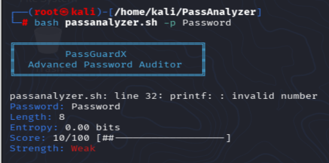
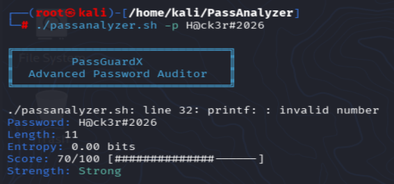

# 🔐 PassGuardX

### Advanced Password Strength Checker in Bash

---

## 🔐 Introduction

**PassGuardX** is a powerful Bash-based password strength checker designed to evaluate the security of passwords using multiple analysis techniques. It calculates entropy, detects common patterns, and checks against dictionary words to provide an accurate strength score.

Weak passwords are one of the most common security risks, and this tool helps identify them by providing clear feedback along with a strength rating from **Weak to Very Strong**.

Lightweight, fast, and easy to use, PassGuardX is ideal for **cybersecurity learners, ethical hackers, and developers**.

---

## 🚀 Features

* 🔑 Password strength analysis (Weak / Medium / Strong / Very Strong)
* 📊 Entropy calculation
* 🧠 Pattern detection (repeats, sequences)
* ⚠️ Dictionary-based weakness detection
* 🎨 Colorful CLI output
* 📈 Strength meter (progress bar)
* ⚡ Fast and lightweight

---

## 📸 Screenshots

### ❌ Weak Password Example



### ✅ Strong Password Example



---

## ⚙️ Installation

```bash
git clone https://github.com/utkarsh206/PassGuardX.git
cd PassGuardX
chmod +x passguardx.sh
```

---

## ▶️ Usage

### 🔹 Interactive Mode

```bash
./passguardx.sh
```

### 🔹 Direct Password Input

```bash
./passguardx.sh -p "YourPassword123!"
```

---

## 🧪 Example Output

```bash
Password: H@ck3r#2026!Secure
Length: 18
Entropy: 98.23 bits
Score: 92/100 [##################--]
Strength: Very Strong
```

---

## 📂 Project Structure

```bash
PassGuardX/
│── passguardx.sh
│── README.md
│── screenshots/
│    ├── weak.png
│    └── strong.png
```

---

## 🧠 How It Works

* Calculates character pool size
* Uses entropy formula
* Checks for:

  * Lowercase & uppercase letters
  * Numbers & special characters
* Detects:

  * Repeated characters
  * Common sequences (123, abc, qwerty)
* Compares against dictionary words
* Generates final score (0–100)

---

## 🤝 Contributing

Contributions are welcome!
Feel free to fork the repository and submit a pull request.

---

## 📜 License

This project is licensed under the **MIT License**.

---

## 👨‍💻 Author

**Utkarsh Shrivastava**
Aspiring Cyber Security Expert 🔥

---

## ⭐ Support

If you like this project, give it a **star ⭐ on GitHub**!
